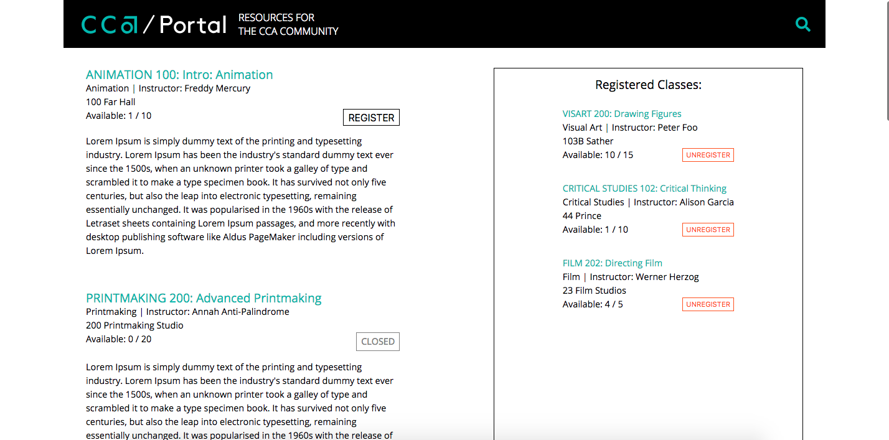

# cca

## Challenge:
Create a single page app that displays class information, and allows students to register for open classes and see which classes they have registered for. No database required. 

## About:
This is the Django backend for the app. The frontend for this app was built with React and can be found on another
<a href='https://github.com/natalie-poulson/cca-frontend'>repo</a>

## Getting Started:
To run this app on your local machine, clone this repo then...
* Install requirements by running the following command inside the project folder in your terminal
  * ```pip3 install -r requirements.txt```
* Add the frontend
  * go <a href='https://github.com/natalie-poulson/cca-frontend'>here</a> and clone that repo
  * add the contents of the frontend repo to this repo
  * Install frontend requirements by going inside the cca_frontend folder and running the following command in your terminal
    * ```npm i```
 * Run the backend
   * ```python3 manage.py runserver```
   * If you visit localhost:8000 you will see the API!
 * Run the frontend
   * ```npm start```
   * This will automatically open localhost:3000 where you will see the app with the information from the API displayed!
  
 
## Features:
* An API that displays a JSON file containing information on classes and serves as the endpoint for front-end server requests
* Displays a list of classes and basic information about that class
  * If there is space available in the class, there is a "REGISTER" button
    * When user clicks "REGISTER", the "Available" count goes down by one and that class information is displayed on the user's "YOUR CLASSES" list
  * If a class is full, the class reads "CLOSED" and the user cannot register for it
* Responsive Design


## Screenshots:
### On larger devices:



### On smaller devices:

